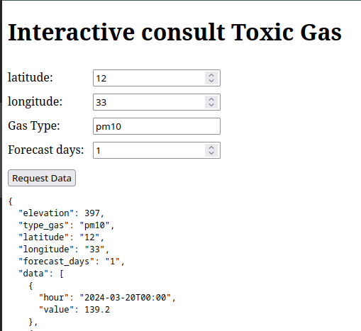

# AIR QUALITY BY LATITUDE AND LONGITUDE

This project was created with the purpose of providing a personalized monitoring and storage solution for the amount of toxic gases (pm10, carbon_monoxide, etc.) in certain coordinates.


## Documentation


## API Reference

#### Get all items stored

```http
  GET /air_quality/store/api/data
```

#### Get item 

```http
  GET /air_quality/store/api/data/${id}
```

| Parameter | Type     | Description                       |
| :-------- | :------- | :-------------------------------- |
| `id`      | `string` | **Required**. Id of item to fetch |

#### Get toxic gases 

```http
  GET /air_quality/api/data
```

| Parameter | Type     | Description                       |
| :-------- | :------- | :-------------------------------- |
| `latitude`      | `float` | **Required**. Site latitude |
| `longitude`      | `float` | **Required**. Site longitude |
| `type_gas`      | `string` | **Required**. Type of toxic gas |
| `forecast_days`      | `number` | **Required**. 16 > forecast_days > 0 |


#### Store toxic gases on database 

```http
  POST /air_quality/api/data
```

 **`Body params`**

```json
  {
      latitude : float
      longitude : float
      type_gas : string
      elevation : float
      forecast_days : number
      tag : string 
      data : list 
  }
```

#### WebSocket Service

From socker-template run the Template.html

With this it is possible to receive the parameters through a form and obtain a response from the server with bidirectional communication




## Installation

Install project with docker-compose.

```bash
  git clone https://github.com/daniel542813x/air_quality_by_coordinates.git

  cd air_quality_by_coordinates

  docker-compose up --build
```

    
## Usage/Examples

### Get carbon monoxide in Pasto (Nariño) 
```javascript
curl --location --request GET 'localhost:8000/air_quality/api/data?latitude=
1.2136&longitude=-77.2811&type_gas=carbon_monoxide&forecast_days=1'
```

### Store previous data on database
```javascript
curl --location --request POST 'localhost:8000/air_quality/api/data' \
--header 'Content-Type: application/json' \
--data-raw '{
    "elevation": 2546.0,
    "tag":"Pasto",
    "type_gas": "carbon_monoxide",
    "latitude": 1.2136,
    "longitude": -77.2811,
    "forecast_days": 1,
    "data": [
        {
            "hour": "2024-03-20T05:00",
            "value": 358.0
        },
        {
            "hour": "2024-03-20T06:00",
            "value": 327.0
        },
        {
            "hour": "2024-03-20T07:00",
            "value": 311.0
        },
        ...
    ]
}'
```


## DEMOS


